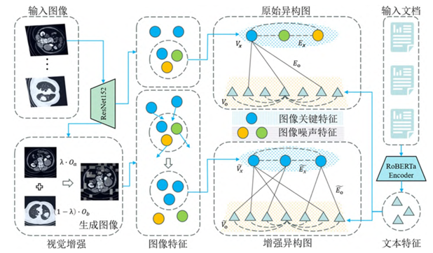
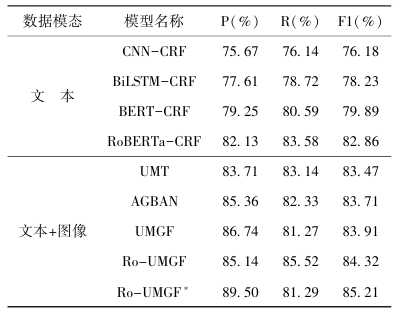
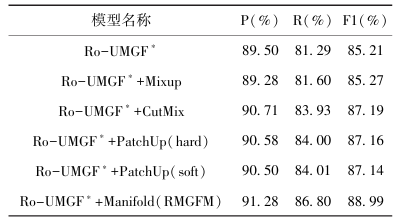
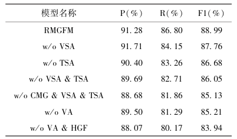

所选论文标题：基于增强异构图融合的多模态医学实体识别研究
论文出处：现代情报，2025年，第45卷第6期
导读生成使用的大模型：DeepSeek

学术论文导读：《基于增强异构图融合的多模态医学实体识别研究》
一、研究背景与动机
随着“健康中国2030”战略的推进，医疗健康数据呈爆炸式增长，如何从多模态数据（如图像与文本）中提取有价值的医学知识成为研究热点。多模态医学实体识别任务旨在利用图像等信息辅助识别文本中的医学实体，是知识图谱构建和信息抽取的重要基础。然而，现有研究面临以下挑战：
①医学图像多为灰度图，存在对比度低、边界模糊、噪声干扰等问题；
②图像与文本特征融合方式简单，难以挖掘模态间的深层语义关联；
③医学文本中专业术语多、实体嵌套现象普遍，增加了识别难度。
为此，本文提出一种基于增强异构图融合的多模态医学实体识别模型（RMGFM），旨在提升图像特征表示能力，增强模态间语义交互，进而提高实体识别效果。
二、核心方法
RMGFM模型由以下四个模块构成：
（1）特征提取模块：
①使用RoBERTa-WWM-EXT提取中文医学文本特征；
②使用ResNet-152提取医学图像特征。
（2）视觉增强模块：
引入Manifold方法在特征空间进行线性插值，生成多样性训练样本，减少图像噪声干扰，提升图像特征表达能力。
（3）增强异构图构建：
将文本与图像特征作为两类节点，构建包含模态内与模态间关系的异构图，捕获细粒度的语义关联信息。

（4）跨模态门控融合模块：
结合自注意力机制、跨模态门控机制和位置前馈网络，对异构图中节点信息进行融合与更新，实现图像与文本特征的深层交互。
最终，融合后的特征输入CRF层进行实体标签预测。

三、主要结果
实验在自建的中文多模态医学数据集上进行，包含五类医学实体（疾病、体征、器官、属性、诊断）。
主要结果如下：

RMGFM模型的F1值达到88.99%，相比UMT、AGBAN、UMGF等多模态基线模型分别提高了5.52%、5.28%和5.08%。引入视觉增强模块后，F1值提升了3.78%，验证了Manifold方法在图像去噪与特征增强方面的有效性。
消融实验表明，移除异构图融合或视觉增强模块均导致性能下降，说明两者对模型性能具有协同提升作用。

四、个人小结
本文提出的RMGFM模型在中文多模态医学实体识别任务中表现出色，具有以下亮点：
①方法创新性强：将增强异构图融合引入医学领域，结合视觉增强与图结构建模，有效解决了图像噪声与模态语义缺失问题；
②实验设计严谨：通过多组对比实验和消融分析，系统验证了各模块的有效性；
③应用价值高：为医学知识图谱构建、多模态信息融合等研究提供了可行思路。
不足之处在于：模型对图像质量仍有一定依赖，未来可进一步探索弱监督或自监督学习方法，提升在低质量图像下的鲁棒性。此外，模型在更多多模态任务（如医学视觉问答）中的推广性也值得后续研究。
